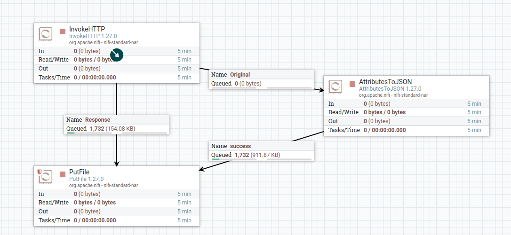
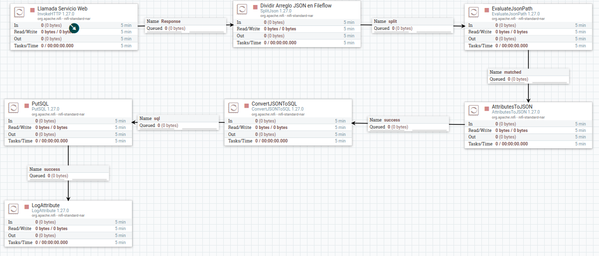
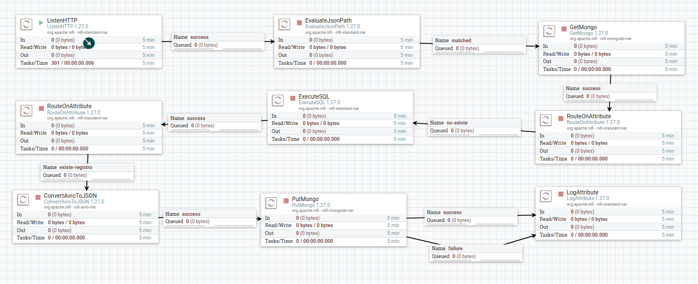

# Apache Nifi Demo
Demostración de Proyecto de Apache Nifi para JConf Dominicana 2024

## Presentación

https://bit.ly/3LHS5ox

## Versión

- Java 21
- Apache Nifi 1.27.0

## Inicio del proyecto

Para arrancar el proyecto de Apache Nifi, ver la documentación oficial
para su instalación e inicio.

## Ejemplos disponibles

### Conceptos básicos:

En nuestro primer ejemplo, estamos abordando los conceptos básicos de Apache Nifi
bajo el siguiente flujo:

1. Un proceso obtiene la información llamando un Endpoint.
2. Los datos recibidos en JSON son procesados.
3. La información es almacenada en un archivo.

[Enlace al template](./plantillas/Ejemplo_básico.xml)

### Leer información EndPoint y almacenar en una Base de Datos

Estaremos llamando un EndPoint y el dato recibido estaremos almacenando en una base datos relacional,
en nuestro caso Mysql. 

[Enlace al template](./plantillas/Ejemplo_Cliente_HTTP_a_Base_de_Datos.xml)

### Servidor Web de Mysql a MongoDB

Desde un endpoint servido desde Apache Nifi, se inica el proceso
para buscar el registro en MongoDB, si no existe consulta el dato
en Mysql y lo almacena en MongoDB.

[Enlace al template](./plantillas/Ejemplo_Servidor_Web_-_Consulta_Mysql_a_MongoDB.xml)

